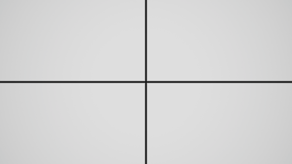
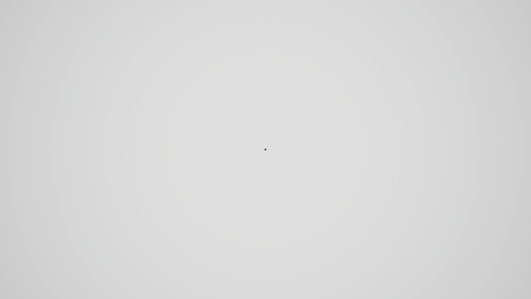
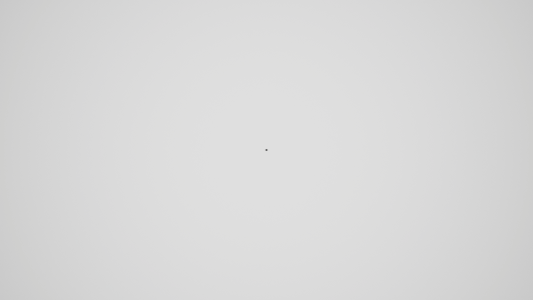
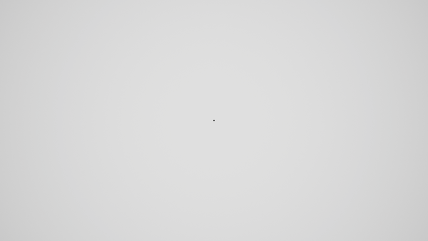

<p align="center">
  
</p>

# TransitionFX

[](https://www.fab.com/listings/82f9a51f-52e6-4a01-a637-43a4dac76c0a)
[](https://www.unrealengine.com/)
[](CHANGELOG.md)
[](LICENSE)
[](https://www.fab.com/listings/82f9a51f-52e6-4a01-a637-43a4dac76c0a)
[](https://www.fab.com/listings/82f9a51f-52e6-4a01-a637-43a4dac76c0a)
[](https://github.com/sponsors/EmbarrassingMoment)

> 日本語版はこちら → [README.ja.md](README.ja.md)

## Description
TransitionFX is a lightweight and advanced procedural screen transition system for Unreal Engine 5.
It renders high-quality transitions based on SDF (Signed Distance Field) math without using textures, and can be implemented from Blueprints with just a single node.

## Design Philosophy

TransitionFX is designed with the top priority of enabling **indie and small-team developers to easily add transition effects to their games after the fact**. The goal is to incorporate high-quality transitions into games without requiring a dedicated tech artist and with minimal additional code.

### Data-Driven Design
All transition settings — effect type, duration, easing, audio — are consolidated into **Transition Preset (Data Asset)**. From Blueprints, simply pass the preset to the `Play Transition And Wait` node. Designers can swap presets to change effects without programmers modifying any calling code.

### Latent Action Pattern
TransitionFX uses **Latent Actions** for Blueprint nodes, eliminating the need for manual callback functions or flag management. Simply connect logic after the Completed pin for sequential execution. Combined with `bHoldAtMax` and `ReleaseHold`, loading screen patterns are also achievable.

### GameInstance Subsystem
The manager runs as a **GameInstance Subsystem**, persisting state across level transitions. The sequence of Fade Out → Level Transition → Fade In is managed automatically by the plugin. Input blocking and effect pool management are also handled automatically, minimizing interference with existing game code.

## Features
*   **UE 5.5+ Native:** Optimized for the latest Unreal Engine features.
*   **Procedural Rendering:** Texture-less SDF-based rendering ensures no degradation at any resolution and automatically corrects aspect ratio distortion.
*   **Design-First Workflow:**
    *   **Data Asset Driven:** Manage transition patterns, duration, and curves as reusable "Presets".
    *   **Auto Input Blocking:** Automatically handles player input blocking during transitions.
    *   **Pause Support:** Works smoothly even when the game is paused.
*   **Versatile Control:**
    *   **Forward / Reverse:** Control "Fade Out" and "Fade In" with a single preset using Transition Modes.
    *   **Speed Control:** Dynamic playback speed adjustment via `SetPlaySpeed`.
*   **Audio Integration:** Synchronize Sound Effects (SFX) with your transitions. The system manages the audio lifecycle, ensuring sounds play on start and stop automatically if the transition is cancelled.
*   **Event System:** Access `OnTransitionStarted`, `OnTransitionCompleted`, and `OnTransitionHoldStarted` delegates for precise gameplay logic timing.
*   **Blueprint Support:** Includes a Latent Action node (`PlayTransitionAndWait`) for clean and easy scripting.

## Requirements & Platform Support

*   **Engine Version:** Unreal Engine **5.5** or later. Earlier versions (5.3, 5.4) are not officially supported.
*   **Project Type:** Works with both **C++ and Blueprint-only** projects. No C++ coding is required for standard use.
*   **Rendering:** Requires a PostProcess-capable rendering pipeline (Deferred or Forward with PostProcess enabled).
*   **Platforms:** Windows (DX12 SM6). Console and mobile platforms have not been officially tested — SDF-based effects are GPU-bound, so performance on low-end devices may vary.

## Sample Project

A ready-to-use sample project is available on the [Releases page](https://github.com/EmbarrassingMoment/TransitionFX_Dev/releases).
It includes the full plugin source and a showcase level demonstrating all 22+ transition effects.

▶ [Watch the sample video on YouTube](https://www.youtube.com/watch?v=L8d-S7VqaMs&feature=youtu.be)

**Requirements:** Unreal Engine 5.5, Windows, DirectX 12 / SM6, Visual Studio 2022 (Game Development with C++ workload)

1. Download `TransitionFX_SampleProject_vX.X.X.zip` from the Releases page.
2. Extract the zip to a folder (avoid paths with spaces or non-ASCII characters).
3. Right-click `TransitionFX_Dev.uproject` and select **"Generate Visual Studio project files"**.
4. Open `TransitionFX_Dev.uproject`. When prompted to rebuild missing modules, click **Yes**.
5. Once the editor opens, press **Play** in the `L_ShowCase` level to explore all effects.

> **Note:** The first launch will compile shaders, which may take several minutes.

## Installation

### Option A: Install from Fab (Recommended)
1. Get the plugin from [Fab](https://www.fab.com/listings/82f9a51f-52e6-4a01-a637-43a4dac76c0a).
2. In the Unreal Editor, open **Window > Fab** to open the Fab browser.
3. Find `TransitionFX` in your library and click **Add to Project**.
4. Enable `TransitionFX` in the editor plugins window.

### Option B: Manual Installation
1. Download the plugin from the release page.
2. Place the `TransitionFX` folder into your project's `Plugins` directory.
3. Enable `TransitionFX` in the editor plugins window.


## Quick Start

### 1. Create a Preset
Right-click in Content Browser > `Miscellaneous` > `Data Asset`.
Select the `TransitionPreset` class and name it (e.g., `DA_FadeBlack`).

<!-- IMAGE: quickstart_create_data_asset.png - Screenshot of Content Browser showing Data Asset creation flow -->

*   **Effect Class:** Select `PostProcessTransitionEffect`.
*   **Transition Material:** Select `M_Transition_Master` (or `M_Transition_Iris`, `M_Transition_Diamond`, etc.).
*   **Default Duration:** Set duration in seconds (e.g., `1.0`).
*   **Progress Curve:** (Optional) Set a float curve to control the ease-in/out of the transition.
*   **bAutoBlockInput:** Set to `True` to automatically disable player input during the transition.
*   **bTickWhenPaused:** Set to `True` to allow the transition to play even when the game is paused.
*   **Priority:** Set the rendering priority (default: 1000).
*   **Audio:** (Optional) Assign a Sound asset to play. Includes Volume and Pitch controls.


### 2. Call from Blueprint
Use the `Play Transition And Wait` node in your Level Blueprint or GameInstance.


*   **Fade Out (Forward):**
    `Play Transition And Wait` (Preset: `DA_FadeBlack`, Mode: `Forward`, Speed: `1.0`)
    *(Screen stays black after completion)*

*   **Fade In (Reverse):**
    `Play Transition And Wait` (Preset: `DA_FadeBlack`, Mode: `Reverse`, Speed: `1.0`)
    *(Effect is removed automatically upon completion)*

*   **Random Play:**
    Use the `Play Random Transition And Wait` node to play a random transition from an array of presets.

### 3. Events
You can bind to the following events in the `TransitionManagerSubsystem`:
*   **OnTransitionStarted:** Fired when the transition begins.
*   **OnTransitionCompleted:** Fired when the transition finishes.
*   **OnTransitionHoldStarted:** Fired when the transition holds at max progress (1.0) (if `bHoldAtMax` is true).
*   **OnTransitionProgressChanged:** Broadcasts the eased progress (0.0 to 1.0) each tick while a transition is active.
*   **OnProgressThresholdReached:** Fires once when progress crosses a value registered via `AddProgressThreshold`.

> For a detailed guide including loading screen patterns, debug tips, and event usage, see the [Quick Start Guide](docs/QUICKSTART_EN.md).

## Transition Modes: Forward / Reverse / Invert

The `Invert` flag flips which area of the screen is covered — it is **not** the same as `Reverse` (which reverses playback direction).

> All previews below use the **Iris** effect with `Mode: Forward` to isolate the effect of the Invert flag.

| Invert | Behavior | Preview |
| :--- | :--- | :--- |
| **Off** (default) | The effect shape **covers** the screen (closes inward). Standard Fade Out. |  |
| **On** | The effect shape **reveals** the screen (opens outward). Inverts the mask. |  |

> **Tip:** To achieve a Fade In without using `Reverse` mode, set `Mode: Forward` + `Invert: True`.

## API Reference
The `TransitionManagerSubsystem` provides several callable functions for advanced control:

*   **StopTransition():** Instantly stops the current transition.
*   **ReverseTransition(bool bAutoStop):** Reverses the playback direction (e.g., from Fade Out to Fade In).
*   **SetPlaySpeed(float NewSpeed):** Changes the playback speed multiplier dynamically.
*   **GetCurrentProgress():** Returns the current progress (0.0 to 1.0).
*   **IsTransitionPlaying():** Returns true if a transition is currently active.
*   **IsCurrentTransitionFinished():** Returns true if the transition has reached its end state (useful for polling).

## Built-in Effects

| Effect Name | Description | Preview |
| :--- | :--- | :--- |
| **Fade** | Standard opacity fade. Simple and lightweight. |  |
| **Iris** | Classic circular wipe closing toward the center. Aspect ratio corrected. |  |
| **Flower Iris** | An iris wipe in the shape of a flower with rounded petals. The number of petals and the flower's shape (sharpness) are adjustable. |  |
| **Diamond** | Diamond-shaped wipe closing toward the center. Retro style. |  |
| **Box** | A simple square expanding from the center. Basic geometric transition. |  |
| **Linear Wipe** | Directional wipe (adjustable Angle). Accurately covers the screen from edge to edge. |  |
| **Sliding Doors** | A horizontal wipe where two panels slide from opposite sides and meet in the center, like elevator or airlock doors. |  |
| **Corner Wipe** | A directional wipe that starts from a specified corner and expands diagonally until it covers the entire screen. The origin corner (0-3) can be dynamically selected. |  |
| **Split** | A stylish wipe that splits the screen in half from the center and opens outward. Supports adjustable split angles (horizontal, vertical, diagonal). |  |
| **Wavy Curtain** | A directional wipe similar to Linear Wipe, but with an animated wavy boundary like a curtain. |  |
| **Radial Wipe** | Clock-like radial wipe. Supports smooth edges and adjustable start angle. |  |
| **Tiles** | The screen is divided into a grid, and blocks expand outward from the center like a wave. |  |
| **Polka Dots** | A wave of expanding circles (halftone pattern) covers the screen. Pop and modern look. |  |
| **Blinds** | Stylish stripe/venetian blind effect. Stripes expand and merge to cover the screen. |  |
| **Spiral** | A hypnotic spiral effect that swirls into the center. Supports adjustable rotation spin and start angle. |  |
| **Random Tiles** | A stochastic transition where grid tiles appear in a random order using procedural noise. |  |
| **Dissolve** | A classic transition where the screen dissolves like mist or sand using procedural noise. Optimized with a precise threshold margin. |  |
| **Wind** | A directional wipe with streak noise, simulating wind blowing the image away. |  |
| **Cross Wipe** | A cross shape expands from the center, pushing the image into the four corners until it vanishes. |  |
| **Texture Mask** | Uses a grayscale texture to determine the transition order (Black=Start, White=End). Supports custom mask textures via Parameter Overrides. |  |
| **TV Switch Off** | A retro CRT TV turn-off effect. Collapses vertically into a line, then horizontally into a point. |  |
| **Hexagon** | A sci-fi style honeycomb wipe. A wave of hexagonal cells smoothly shrinks into their centers. |  |
| **Triangle** | A stylish polygon-style wipe where sharp triangles shrink and disappear in a ripple effect from the center. |  |
| **Checkerboard** | A checkerboard pattern that tiles the screen and expands to cover it. Classic retro feel. |  |
| **Pixelate** | A pixelation effect that progressively reduces the screen resolution until it fades out. | |

> **Tip for Texture Masks:**
> When importing your mask textures, ensure you uncheck **sRGB** and set Compression Settings to **Masks (no sRGB)** or **Grayscale** for accurate value reading.

## Transition Timing & Easing
Control how the transition progresses over time using the `EasingType` property in your Transition Preset.

> All previews below use the **Iris** effect to isolate the difference in easing behavior.

| Easing Type | Description | Preview |
| :--- | :--- | :--- |
| **Linear** | Constant speed (Default). Good for simple fades. |  |
| **EaseInSine** | Starts slow, accelerates smoothly. |  |
| **EaseOutSine** | Starts fast, decelerates smoothly. |  |
| **EaseInOutSine** | Smooth acceleration at start and deceleration at end. |  |
| **EaseInCubic** | Starts slow with stronger acceleration. |  |
| **EaseOutCubic** | Starts fast with stronger deceleration. |  |
| **EaseInOutCubic** | Pronounced ease at both ends. |  |
| **EaseInExpo** | Near-still start, exponential acceleration. |  |
| **EaseOutExpo** | Fast start, exponential deceleration. |  |
| **EaseInOutExpo** | Dramatic ease at both ends. |  |
| **EaseOutElastic** | Elastic overshoot at the end of the transition. |  |
| **EaseOutBounce** | Bouncing effect at the end of the transition. |  |
| **Custom** | Allows you to supply your own `FloatCurve` asset. | — |

*Note: The `Transition Curve` slot will only appear when `Custom` is selected.*

See [easings.net](https://easings.net/) for visualization of these curves.

## Performance Tips

### Shader Preloading (Warmup)
To prevent frame drops (hitching) when a transition plays for the first time, you can pre-compile the shaders using the Preload API.

**Problem:** Unreal Engine compiles shaders on-demand, which can cause a slight stutter (hitch) the first time a transition effect plays.
**Solution:** The `PreloadTransitionPresets` function creates a temporary dynamic material instance to force the engine to prepare the shaders *before* gameplay starts.

**How to use:**
Call `PreloadTransitionPresets` in a safe place like **GameInstance Init** or **Level BeginPlay**.
Pass an array of your most commonly used Transition Presets to this function.


```cpp
// C++ Example
TArray<UTransitionPreset*> MyPresets = { FadePreset, WipePreset };
TransitionSubsystem->PreloadTransitionPresets(MyPresets);
```
*This creates dummy materials for a single frame to ensure the GPU is ready.*

**API Reference:**
*   **Function:** `TransitionManagerSubsystem->PreloadTransitionPresets(TArray<UTransitionPreset*> Presets)`

### Asynchronous Loading (Soft References)
If you want to load transition assets on-demand (e.g., during a loading screen) to save memory, use the Async API.
It loads the assets in the background, then automatically runs the shader warmup, and finally fires a callback event.

**How to use:**
1. Pass an array of **Soft Object References** to `AsyncLoadTransitionPresets`.
2. The system will load them in the background and warm up the shaders.
3. The `OnComplete` event fires when everything is ready.

**Blueprint Usage:**
Pass an array of Soft Object References. Connect your logic (e.g., Open Level) to the 'On Complete' delegate pin.

```cpp
// C++ Example
TArray<TSoftObjectPtr<UTransitionPreset>> SoftPresets = { ... };

TransitionSubsystem->AsyncLoadTransitionPresets(SoftPresets, FTransitionPreloadCompleteDelegate::CreateLambda([]()
{
    UE_LOG(LogTransitionFX, Log, TEXT("Assets loaded and shaders ready!"));
}));
```

**API Reference:**
*   **Function:** `AsyncLoadTransitionPresets(TArray<TSoftObjectPtr<UTransitionPreset>> Presets, FTransitionPreloadCompleteDelegate OnComplete)`

## Limitations & Notes

*   **Single transition at a time:** Only one transition can play at a time. Starting a new transition will replace the currently active one.
*   **PostProcess-based rendering:** Transitions are rendered as a PostProcess effect. This means:
    *   The effect is drawn on top of the entire viewport, including debug UI rendered to the viewport.
    *   UMG/Slate widgets rendered above the viewport are **not** covered by the transition.
    *   If you need to hide UI during transitions, use the `OnTransitionStarted` delegate to manually set widget visibility.
*   **Multiplayer:** TransitionFX operates **locally on each client**. The subsystem runs per GameInstance, so it is inherently client-side. There is no built-in replication or server-side transition control.
*   **Packaging:** The plugin is included in packaged builds automatically when enabled in the Plugins window. Ensure `TransitionFX` is listed in your `.uproject` file under `Plugins` if you manage plugin references manually.

## Roadmap

> Planned features for future releases. Priorities may shift based on community feedback.

### New Effects
- [ ] New transition effects are planned — specific effects are to be determined based on user feedback and creative exploration

### Feature Extensions
- [ ] **Transition Color per Preset** `High` — Expose a default transition color property on presets (e.g., fade-to-white) without requiring parameter overrides at every call
- [ ] **UMG Widget-Layer Transitions** `High` — An alternative rendering path using a full-screen UMG widget, allowing the transition to cover Slate/UMG UI layers
- [ ] **Origin Point Override** `Medium` — Allow center-based transitions (Iris, Diamond, Tiles, etc.) to expand from a custom screen-space coordinate
- [ ] **Transition Chaining / Sequencing** `Medium` — A node or data asset that plays a sequence of presets back-to-back
- [x] **OnTransitionProgress Delegate** `Medium` — A delegate that broadcasts progress each tick, removing the need to poll `GetCurrentProgress()`. Also includes threshold-based callbacks via `AddProgressThreshold`.
- [ ] **Simultaneous Transitions** `Low` — Support for layering multiple independent transitions with a multi-slot manager

### Improvements & Optimization
- [ ] **Preset Validation in Editor** `High` — Warn if a preset has no material or is missing the required `Progress` parameter
- [ ] **Editor Preset Thumbnails** `Medium` — Auto-generate static thumbnails for TransitionPreset assets in the Content Browser
- [ ] **Blueprint Preset Picker Widget** `Medium` — A visual dropdown showing available presets with mini-previews
- [ ] **Configurable Pool Size** `Low` — Expose the effect pool cap (currently hardcoded at 3) via project settings
- [ ] **Shader Complexity Tiers** `Low` — Simplified material variants for performance-sensitive platforms

### Documentation & Tutorials
- [ ] **Material Parameter Reference** `High` — Dedicated doc listing every built-in material's adjustable parameters
- [ ] **Video Tutorial: Getting Started** `Medium` — Installation, preset creation, and first transition walkthrough
- [ ] **Video Tutorial: Level Transition Workflow** `Medium` — Demonstrating `OpenLevelWithTransition` and the hold-at-max loading screen pattern
- [ ] **Custom Effect Authoring Guide** `Medium` — Step-by-step guide for creating new SDF materials and wiring them via `ITransitionEffect`
- [ ] **Example Project / Sample Maps** `Medium` — Downloadable sample with pre-configured presets and Blueprint examples for common patterns

## Custom Effects

TransitionFX supports creating your own custom transition effects by implementing the `ITransitionEffect` interface.

1. Create a new C++ class that inherits from `UObject` and implements `ITransitionEffect`.
2. Implement the required methods: `Initialize`, `UpdateProgress`, `Cleanup`, `SetInvert`, and `SetParameters`.
3. In your `TransitionPreset`, set `Effect Class` to your custom class and assign your custom material.

See [`ITransitionEffect.h`](Plugins/TransitionFX/Source/TransitionFX/Public/ITransitionEffect.h) and [`PostProcessTransitionEffect`](Plugins/TransitionFX/Source/TransitionFX/Public/PostProcessTransitionEffect.h) for a reference implementation.

## FAQ

### Q: Does TransitionFX work with UEFN (Unreal Editor for Fortnite)?

No. TransitionFX relies on runtime features that UEFN restricts, including dynamic PostProcessVolume spawning via `SpawnActor`, `UMaterialInstanceDynamic` creation and parameter manipulation, GameInstance Subsystems, and C++ plugin loading. These are fundamental architectural dependencies, not minor incompatibilities, so a simple build flag or conditional compilation cannot resolve them. If Epic Games expands UEFN's runtime capabilities in the future, we will re-evaluate support.

For common questions and troubleshooting, see the [FAQ](docs/FAQ_EN.md).

## License
MIT License
